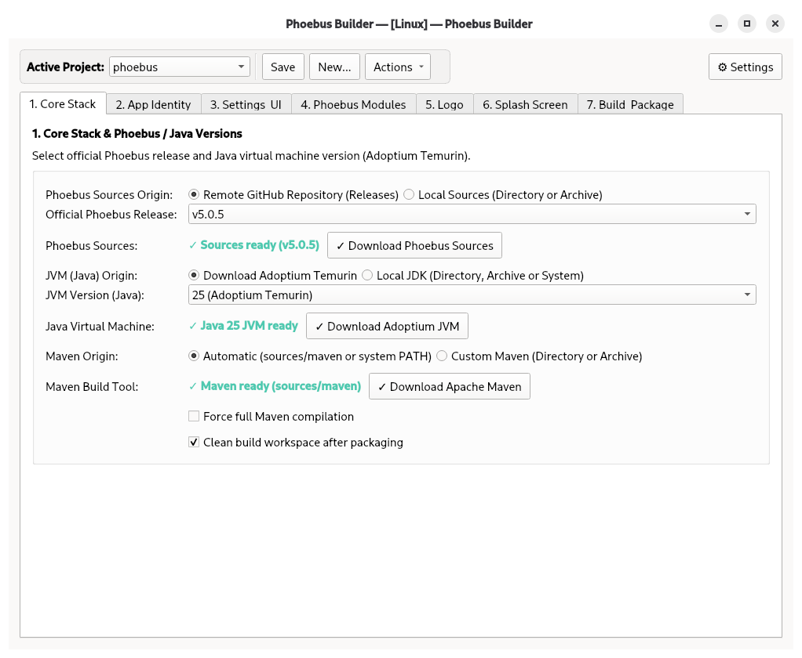

# Phoebus Builder

[](https://github.com/XavSPM/Phoebus-Builder)
[](https://www.python.org/)
[](https://pypi.org/project/PySide6/)
[](LICENSE)

**Phoebus Builder** est une suite logicielle Python complète dotée d'une interface graphique moderne (**GUI PySide6 / Qt 6**) et d'un assistant interactif en ligne de commande (CLI) pour configurer, personnaliser, compiler et générer des installateurs natifs autonomes pour **Control System Studio (Phoebus)** sur **Linux** (`.deb`, `.rpm`) et **Windows** (`.msi`, `.exe`).



---

## Sommaire

- [Fonctionnalités Principales](#fonctionnalités-principales)
- [Prérequis Système](#prérequis-système)
- [Installation](#installation)
- [Démarrage Rapide](#démarrage-rapide)
- [Architecture du Workspace & des Paramètres](#architecture-du-workspace--des-paramètres)
- [Interface Graphique (GUI)](#interface-graphique-gui)
- [Ligne de Commande & Automatisation CI/CD](#ligne-de-commande--automatisation-cicd)
- [Tests Automatisés](#tests-automatisés)
- [Organisation du Projet](#organisation-du-projet)
- [Licence & Auteurs](#licence--auteurs)

---

## Fonctionnalités Principales

* **Interface Graphique PySide6 / Qt 6 & Assistant Console Interactif** : Application de bureau complète en 7 onglets avec journalisation en direct et prévisualisation d'images, ainsi qu'un assistant terminal interactif et un mode batch non-interactif pour l'intégration continue.
* **Bilingue Anglais / Français** : Démarrage en **anglais** par défaut lors de la première utilisation, avec basculement instantané en **français** depuis la boîte de dialogue Paramètres.
* **Répertoire de Travail (Workspace)** : Isolation complète des profils de projet, des sources téléchargées et des installateurs générés.
* **Sources en Ligne ou Locales (Mode Hors-Ligne)** :
  * Téléchargement automatique depuis les versions officielles GitHub de Phoebus, ou utilisation directe d'un dossier source local ou d'une archive (`.zip`, `.tar.gz`).
  * Découverte dynamique des modules applicatifs directement analysés depuis le `pom.xml`.
* **Gestion Flexible du JDK Java** :
  * Téléchargement automatique des JDKs **Adoptium Temurin** (Java 17, 21 LTS, 25).
  * Prise en charge des installations JDK locales (incluant `jpackage`) avec détection automatique de l'environnement (`JAVA_HOME`).
* **Intégration d'Apache Maven** :
  * Détection automatique depuis le `PATH` système ou téléchargement portable autonome.
  * Prise en charge d'un Maven local personnalisé (dossier ou archive).
* **Personnalisation Intégrale** :
  * Éditeur visuel intégré et générateur automatique pour `settings.ini`.
  * Intégration transparente de dossiers d'écrans `.bob` et sélection de l'écran d'accueil (`home_display`).
  * Validation et mise au format automatique des icônes (`site_logo.png` / `.ico`) et des écrans de démarrage splash screen (480x300 px).
* **Installateurs Natifs Autonomes** :
  * **Linux** : Paquets Debian (`.deb`) et Red Hat / Fedora / Rocky (`.rpm`) avec intégration complète dans le menu des applications.
  * **Windows** : Installateur Windows (`.msi`) ou Exécutable d'installation (`.exe`) via WiX Toolset.
  * Environnement d'exécution Java allégé et embarqué via `jlink` / `jpackage` (aucun Java requis sur les postes clients).

---

## Prérequis Système

| Outil | Linux (Fedora / RHEL / Rocky) | Linux (Debian / Ubuntu) | Windows (10 / 11) |
|---|---|---|---|
| **Python** | Python 3.9+ (`python3-pip`) | Python 3.9+ (`python3-pip`) | Python 3.9+ |
| **Outils de Paquetage** | `sudo dnf install rpm-build` | `sudo apt install fakeroot dpkg` | WiX Toolset 3.11 (auto-téléchargé) |

---

## Installation

Cloner le dépôt depuis GitHub :

```bash
git clone https://github.com/XavSPM/Phoebus-Builder.git
cd Phoebus-Builder
```

### Option A : Installation Directe

```bash
pip install .
```

Une fois installé, la commande `phoebus-builder` est directement disponible dans votre terminal.

Il est possible que votre système d'exploitation vous interdise d'installer des paquets autrement que par le gestionnaire de paquets système.

Si c'est le cas, vous pouvez forcer l'installation :

```bash
pip install --break-system-packages .
```

### Option B : Environnement Virtuel

```bash
# 1. Créer l'environnement virtuel
python3 -m venv .venv

# 2. Activer l'environnement virtuel
# Sur Linux / macOS :
source .venv/bin/activate
# Sur Windows (PowerShell) :
.venv\Scripts\Activate.ps1
# Sur Windows (CMD) :
.venv\Scripts\activate.bat

# 3. Installer le paquet en mode développement éditable
pip install --upgrade pip
pip install -e .
```

---

## Démarrage Rapide

Lancez l'application selon l'une des méthodes suivantes :

```bash
# 1. Via la commande globale en ligne de commande
phoebus-builder

# 2. Via l'exécution du module Python
python3 -m phoebus_builder

# 3. Via le script à la racine
python3 build_phoebus.py

# 4. Si installé avec la méthode A, lancement via le lanceur d'applications
```

---

## Architecture du Workspace & des Paramètres

Phoebus Builder garantit la propreté de votre système de fichiers :

1. **Assistant de Premier Démarrage** :
   - Lors du premier lancement, l'application vous invite à désigner votre **Répertoire de travail (Workspace)**.
   - Aucun dossier par défaut n'est imposé : vous gardez le contrôle total sur l'emplacement de vos configurations, sources et compilations.

2. **Préférences Globales Utilisateur (`~/.phoebus-builder/.phoebus-builder-app.json`)** :
   - Les paramètres globaux (emplacement du workspace choisi, langue de l'application, validation du premier démarrage) sont stockés dans :
     - **Linux** : `/home/<utilisateur>/.phoebus-builder/.phoebus-builder-app.json`
     - **Windows** : `C:\Users\<Utilisateur>\.phoebus-builder\.phoebus-builder-app.json`

3. **Structure Interne du Workspace** :
   ```
   <votre-workspace>/
   ├── configs/            # Profils de configuration des projets (ex. configs/mobilis/)
   │   └── <nom_projet>/
   │       ├── config.json
   │       ├── settings.ini
   │       ├── logo.png / logo.ico
   │       ├── site_splash.png
   │       └── ui/          # Écrans .bob intégrés
   ├── sources/            # Caches des sources Phoebus et des JDKs
   │   ├── phoebus/
   │   ├── jdk/
   │   └── maven/
   └── output/             # Paquets compilés (.deb, .rpm, .msi, .exe)
   ```

4. **Boîte de Dialogue des Paramètres (⚙ Paramètres)** :
   - Accessible à tout moment via le bouton **⚙ Paramètres** en haut à droite de l'IHM pour :
     - Modifier l'emplacement du répertoire de travail (avec option de migration des projets existants).
     - Basculer la langue de l'interface entre **English** et **Français**.

---

## Interface Graphique (GUI)

L'IHM guide le processus d'empaquetage à travers **7 onglets structurés** :

1. **Socle Technique** : Choix de la version officielle de Phoebus (ex: `v5.0.5`) ou de sources locales, sélection de la machine virtuelle Java (Adoptium Temurin 17, 21, 25 ou JDK local), configuration de Maven et sélection du format installateur (`.msi` / `.exe` sous Windows).
2. **Identité App** : Métadonnées applicatives (Nom, Version, Description, Fournisseur, Copyright, URL Web, Mainteneur).
3. **Paramètres & IHM** : Génération et personnalisation visuelle de `settings.ini`, sélection du dossier d'écrans `.bob`, et sélection de l'écran d'accueil par défaut (`home_display`).
4. **Modules Phoebus** : Sélection visuelle des modules avec profils rapides (*IHM Seule*, *Standard*, *Personnalisé*) pour optimiser la taille du paquet final.
5. **Logo** : Prévisualisation et validation de l'icône de l'application (génère automatiquement `site_logo.png` 64x64 et `logo.ico`).
6. **Splash Screen** : Prévisualisation et recadrage de l'image de démarrage (480x300 px).
7. **Construction** : Récapitulatif exhaustif des options, choix du dossier de sortie, et suivi multithreadé de la compilation en temps réel.

---

## Ligne de Commande & Automatisation CI/CD

Phoebus Builder est entièrement pilotable en ligne de commande pour les environnements serveurs ou les chaînes d'intégration continue :

```bash
# Ouvrir l'IHM pré-chargée avec un projet spécifique
phoebus-builder --config configs/mobilis

# Spécifier explicitement un répertoire de travail
phoebus-builder --workspace /chemin/vers/workspace

# Lancer la compilation immédiate en mode batch non-interactif (CI/CD)
phoebus-builder --config configs/mobilis -y

# Valider la configuration et les prérequis système sans compiler (dry-run)
phoebus-builder --config configs/mobilis --dry-run

# Forcer l'assistant terminal interactif pas-à-pas
phoebus-builder --cli

# Nettoyer les caches temporaires de compilation
phoebus-builder --clean

# Surcharger des paramètres à la volée
phoebus-builder --config configs/mobilis -y --platform windows --win-package-type exe
```

---

## Tests Automatisés

Le projet dispose d'une couverture de tests automatisée exhaustive validant les modèles de configuration, la détection système, les traductions, les conversions d'images et la persistance des paramètres :

```bash
python3 -m unittest discover tests
```

---

## Organisation du Projet

```
Phoebus-Builder/
├── .gitignore
├── LICENSE
├── MANIFEST.in
├── pyproject.toml              # Métadonnées de packaging PEP 621
├── README.md                   # Documentation en anglais
├── README_FR.md                # Documentation en français
├── build_phoebus.py            # Script d'exécution directe
├── configs/                    # Profils de configuration fournis
│   └── <nom_projet_1>/
│   └── <nom_projet_2>/
├── doc/                        # Documentation et captures d'écran
│   └── phoebus-bulder.png
├── phoebus_builder/            # Package principal
│   ├── app_settings.py         # Persistance des paramètres globaux
│   ├── assets/                 # Raccourcis .desktop et icônes
│   ├── cli.py                  # Point d'entrée et routeur CLI / GUI
│   ├── config.py               # Modèle BuildConfig et validation
│   ├── downloader.py           # Moteur de téléchargement Phoebus, Maven, WiX
│   ├── file_browser.py         # Sélecteurs de fichiers natifs
│   ├── gui.py                  # Interface graphique PySide6 (7 onglets)
│   ├── i18n.py                 # Moteur de traduction multilingue
│   ├── image_utils.py          # Validation d'images et conversion ICO
│   ├── jvm.py                  # Gestionnaire Adoptium & JDKs locaux
│   ├── modules.py              # Analyseur de modules et parser pom.xml
│   ├── packager.py             # Compilation Maven et exécution jpackage
│   ├── resources/              # Modèles et scripts de packaging
│   ├── settings_editor.py      # Éditeur visuel de settings.ini
│   ├── settings_generator.py   # Générateur automatique de settings.ini
│   ├── theme.py                # Thème graphique moderne
│   └── wizard.py               # Assistant console interactif
└── tests/                      # Suite de tests unitaires automatisés
```

---

## Licence & Auteurs

* **Auteur** : Xavier Goiziou (<xavier.goiziou@gmail.com>)
* **Dépôt** : [https://github.com/XavSPM/Phoebus-Builder](https://github.com/XavSPM/Phoebus-Builder)
* **Licence** : Ce projet est sous licence [MIT](LICENSE).
